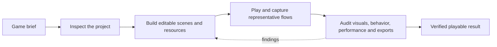

<p align="center">
  
</p>

<p align="center">
  <strong>A production-focused Codex skill for building and polishing Godot 4 games.</strong><br>
  <a href="./README.ru.md">Русская версия</a> · <a href="https://learn.chatgpt.com/docs/build-skills">How Codex skills work</a>
</p>

`skill-godot` gives Codex a repeatable workflow for creating real Godot projects: authored scenes and resources, coherent assets, playable controls, deterministic checks, visual review, performance evidence, and release-ready exports. It covers 2D, 3D, 2.5D, isometric and orthographic games, UI, audio, mobile/web input, and Yandex Games releases.

## Quick start

Ask Codex to install this repository:

```text
Use $skill-installer to install https://github.com/Seno47/skill-godot
```

Then start a game task explicitly:

```text
Use $skill-godot to build a polished isometric café game in Godot 4.
Keep the world editable in scenes and resources, support mouse and touch,
then run the game and verify the core loop at desktop and mobile sizes.
```

Codex can also select the skill automatically when a request clearly matches its description.

## What makes it useful

| Included | What it gives you |
| --- | --- |
| 20 focused production guides | Scene architecture, 2D/3D/2.5D, UI, art, audio, performance, loading, exports, and platform release work |
| 12 deterministic Python helpers | Project snapshots, scene and asset audits, capture support, performance budgets, evidence scorecards, and build-size checks |
| 4 reusable Godot probes | Touch scrolling, button composition, isometric projection, and isometric navigation checks |
| Scene-first authoring rules | Persistent composition stays in `.tscn` scenes and Godot resources instead of disappearing into large runtime scripts |
| Evidence-based completion | The skill runs the project, checks representative viewports, and avoids claiming polish or optimization without proof |

## The production loop



The main [`SKILL.md`](./SKILL.md) is a compact router. It sends Codex only to the references, templates, components, and tests relevant to the current game task.

## Coverage

- **Game production:** gameplay, levels, camera, lighting, collision, navigation, UI, onboarding, audio, VFX, and asset integration.
- **2D and 3D:** native Godot scene patterns with focused guidance for each dimension.
- **2.5D and isometric:** explicit spatial contracts for projection, picking, sorting, elevation, occlusion, pathfinding, and hybrid 2D/3D presentation.
- **Input:** keyboard, mouse, controller, touch, drag gestures, and mobile viewport checks.
- **Optimization:** measured FPS, CPU/GPU/physics investigation, memory and loading analysis, and export-size budgets.
- **Web and Yandex Games:** SDK lifecycle, advertisements, rewarded flows, saves, leaderboards, localization, moderation, and archive QA.
- **Validation:** headless checks, deterministic probes, automated captures, interactive onboarding verification, and independent UX review.

## Isometric and 2.5D workflow

The skill does not treat “isometric” as an art style alone. It establishes one testable spatial contract before gameplay code spreads across the project:

1. Choose the primary architecture: `Node2D`, `Node3D`, or a deliberate hybrid.
2. Define grid axes, tile ratio, origin, elevation step, sort key, picking rule, and navigation representation.
3. Store the contract using [`isometric-spatial-contract.template.md`](./assets/isometric-spatial-contract.template.md).
4. Reuse [`isometric_projection.gd`](./assets/godot-components/isometric_projection.gd) where its contract fits.
5. Adapt the projection and navigation probes to catch round-trip, height-transition, and route regressions.

The full decision guide lives in [`references/isometric-and-2-5d.md`](./references/isometric-and-2-5d.md).

## Installation options

The `$skill-installer` prompt above is the simplest option. For a manual user-scoped installation, clone the repository into the current Codex user skill location.

Windows PowerShell:

```powershell
git clone https://github.com/Seno47/skill-godot "$env:USERPROFILE\.agents\skills\skill-godot"
```

macOS or Linux:

```bash
git clone https://github.com/Seno47/skill-godot "$HOME/.agents/skills/skill-godot"
```

For a skill shared only inside one project, clone or vendor it under `.agents/skills/skill-godot` in that repository. Codex detects skill changes automatically; restart Codex if a newly installed skill does not appear. See the [official OpenAI skill documentation](https://learn.chatgpt.com/docs/build-skills) for discovery scopes and invocation details.

To update a manual installation:

```bash
git -C "$HOME/.agents/skills/skill-godot" pull --ff-only
```

## Example prompts

```text
Use $skill-godot to turn this prototype into a maintainable vertical slice.
Preserve the existing art direction, add touch controls, and verify onboarding.
```

```text
Use $skill-godot to diagnose frame-time spikes in this Godot 4 project.
Measure first, identify the bottleneck, apply a focused fix, and compare evidence.
```

```text
Use $skill-godot to prepare this HTML5 game for Yandex Games.
Add the SDK lifecycle, saves, rewarded ads, leaderboards, Russian localization,
and run the release archive checks without changing the core game loop.
```

## Repository map

```text
skill-godot/
├── SKILL.md                 # Trigger scope and production workflow
├── agents/openai.yaml       # Codex UI metadata and default prompt
├── references/              # Focused production and release guidance
├── scripts/                 # Deterministic auditors and evidence helpers
├── assets/
│   ├── godot-components/    # Reusable Godot building blocks
│   ├── godot-tests/         # Adaptable deterministic probes
│   └── *.template.*         # Spatial, UX, capture, and release templates
├── evals/                   # Evidence schema and scoring rubric
└── tests/                   # Dependency-light and engine-backed tests
```

## Validate a checkout

Most tests require only Python 3:

```bash
python -m unittest discover -s tests -p "test_*.py"
```

The isometric smoke tests run against Godot 4 when `godot4`/`godot` is on `PATH`, or when `GODOT_BIN` points to the editor executable.

PowerShell example:

```powershell
$env:GODOT_BIN = "C:\Tools\Godot\Godot.exe"
python -m unittest discover -s tests -p "test_*.py"
```

## Contributing

Issues and focused pull requests are welcome. Please keep the skill scene-first, evidence-driven, Godot 4-specific, and progressively disclosed: add detailed material to a focused reference or reusable script instead of turning `SKILL.md` into a monolith. Run the test suite before opening a pull request.

## License and status

No license has been selected yet. Public availability does not grant a general reuse or redistribution license. This is an independent community project and is not an official Godot Engine or OpenAI project.

