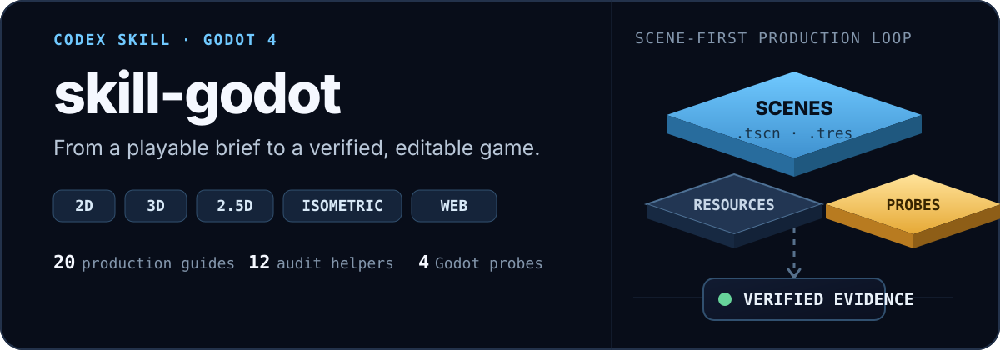
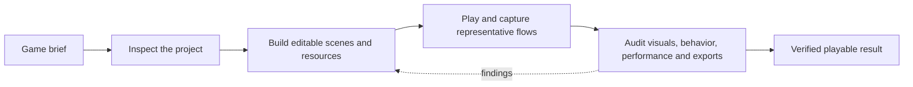

<p align="center">
  
</p>

<p align="center">
  <strong>A production-focused Codex skill for building and polishing Godot 4 games.</strong><br>
  <a href="./README.ru.md">Русская версия</a> · <a href="https://learn.chatgpt.com/docs/build-skills">How Codex skills work</a>
</p>

`skill-godot` gives Codex a repeatable workflow for creating real Godot projects: authored scenes and resources, coherent assets, playable controls, deterministic checks, visual review, performance evidence, and release-ready exports. It covers 2D, 3D, 2.5D, isometric and orthographic games; procedural, strategy, vehicle, shooter and narrative systems; single-player, local/online multiplayer, extraction and honest MMO production slices; accessibility, localization, saves, replay, large worlds, LiveOps, native mobile/XR, runtime authoring, reproducible releases, crash recovery, commerce/cloud/safety, desktop hardware, modding/UGC, stores, and Yandex Games.

## Quick start

Ask Codex to install this repository:

```text
Use $skill-installer to install https://github.com/Seno47/skill-godot
```

Then start a game task explicitly:

```text
Use $skill-godot to build a polished isometric café game in Godot 4.
Keep the world editable in scenes and resources, support mouse and touch,
then run the game and verify the core loop at desktop and mobile sizes.
```

Codex can also select the skill automatically when a request clearly matches its description.

## What makes it useful

| Included | What it gives you |
| --- | --- |
| 63 focused production guides | Scene architecture, visual-style selection, 2D/3D/2.5D, high-angle district production, UI, production-craft/product approval, saves, accessibility, AI, genre/network systems, difficulty/pacing, commerce/cloud/safety, resilience/upgrades, hardware, assets, performance, and release work |
| 41 deterministic Python helpers | Project/asset audits, visual checks, genre-aware difficulty and system contracts, crash/commerce/cloud/safety/upgrade/fault/hardware/assistive probes, rubric composition, capture, budgets, scorecards, and build-size checks |
| 7 reusable Godot probes | Touch scrolling, button composition, third-person controls/HUD mouse routing/visibility, isometric projection, and isometric navigation checks |
| Scene-first authoring rules | Persistent composition stays in `.tscn` scenes and Godot resources instead of disappearing into large runtime scripts |
| Evidence-based completion | The scorecard verifies acceptance ownership plus concrete screenshot/video/review paths and rejects prose-only PASS claims |

## The production loop



The main [`SKILL.md`](./SKILL.md) is a compact router. It sends Codex only to the references, templates, components, and tests relevant to the current game task.

## Coverage

- **Game production:** gameplay, levels, camera, lighting, collision, navigation, UI, onboarding, audio, VFX, and asset integration.
- **Visual direction:** user-authored constraints stay authoritative; open briefs compare viable 2D/3D/hybrid style routes against gameplay readability, identity, coherent asset availability, content-scale consistency, animation/VFX workload, target budgets, UI/localization/accessibility, rights, cost, and maintenance before bulk production.
- **2D and 3D:** native Godot scene patterns with focused guidance for each dimension.
- **2.5D and isometric:** explicit spatial contracts for projection, picking, sorting, elevation, occlusion, pathfinding, and hybrid 2D/3D presentation.
- **Fixed/high-angle 3D districts:** visible urban/terrain boundaries, block massing, landmarks/view corridors, functional story zones, modular variation/repetition budgets, semantic architectural palettes/materials under exact gameplay lighting, and measured follow/look-ahead/pressure-zoom/camera-volume motion.
- **Input:** keyboard, mouse, controller, camera-relative locomotion, orbit/capture recovery, touch, drag gestures, and mobile viewport checks.
- **Durable systems:** versioned save envelopes, atomic/interrupted-write recovery, corruption fallback, migrations, idempotence, and cloud/device conflict policy.
- **AI and generation:** perception fairness, navigation/replan/crowd recovery, capacity evidence, named random streams, solvable seed cohorts, distributions, fallback, and save/resume parity.
- **Specialized genres:** production contracts for strategy/simulation, vehicle/racing, shooter/action, narrative/cinematics, and simultaneous local multiplayer, with builder correctness separated from human feel or comprehension.
- **Accessibility:** remapping, hot-plug and focus recovery, truthful modality/glyphs, non-color meaning, readable subtitles/captions, motion/flash/timing alternatives, and independently verified setting effects.
- **Optimization:** measured FPS, CPU/GPU/physics investigation, memory and loading analysis, and export-size budgets.
- **Web and Yandex Games:** SDK lifecycle, advertisements, rewarded flows, saves, leaderboards, localization, moderation, and archive QA.
- **Multiplayer and persistent online:** server authority, replication, lag/loss/reconnect, dedicated servers, extraction settlement, MMO scope, service capacity, failure recovery, restore, and rollback.
- **Platforms and extensibility:** exact store candidates, clean install/update/signing/SDK lifecycle, plus explicit mod/UGC trust tiers, hostile-content validation, removed-mod recovery, safe mode, and honest isolation limits.
- **Global and advanced production:** localization/plurals/pseudolocalization, replay/ghost/spectator contracts, streamed-world traversal, native mobile devices, LiveOps/privacy, OpenXR/authorized console boundaries, runtime creator tools, and reproducible clean builds.
- **Production resilience and services:** crash/hang recovery and diagnostics, exactly-once commerce entitlements, guest/cloud conflict handling, proportional online safety, upgrade fixtures/rollback, deterministic fault injection, real desktop hardware/display matrices, and real assistive-technology acceptance.
- **Validation:** headless checks, deterministic probes, automated captures, interactive onboarding verification, and independent UX review.

Hybrid work uses a canonical `base+modifier+...` rubric selector. `rubric_case_plan.py`, `evidence_helper.py`, and `eval_scorecard.py` share the same fail-closed composition: applicable gates are unioned and each score floor uses the strictest selected case. This prevents a convenient genre label from silently dropping localization, replay, mobile, LiveOps, or release obligations while keeping unrelated guides out of context.

Complete 2.5D work now has its own `new-2-5d-complete` rubric case. It requires an explicit spatial model, raw quiet/normal/dense/VFX/result art states, production-character motion video, menu and semantic identity review, depth/contact readability, independent target-build UX/visual acceptance, and human audio listening. A `.tscn` containing boxes, spheres, cylinders, shader quads, or particles is editable architecture—not automatic proof of production art.

Fixed/high-angle 3D districts use the composable `high-angle-3d-district-complete` modifier and [`high-angle-3d-districts.md`](./references/high-angle-3d-districts.md). [`high-angle-3d-district-review.template.md`](./assets/high-angle-3d-district-review.template.md) fails repeated perimeter fences, container/backdrop clone filler, meaningless scatter, view corridors ending in void, and random flat facade recoloring even at 100% material coverage. It requires visible boundary/collision agreement, district hierarchy, multi-layer variation, semantic dominant/support/accent material assignment, raw same-zone/cross-zone exact-lighting evidence, and normal-speed camera restoration evidence.

The genre layer now adds conditional production contracts for fighting games, metroidvanias, idle/clicker economies, and quest systems without turning their community examples into universal architecture. A reviewed ecosystem catalogue records when menu/settings frameworks, UI themes, portal bridges, combat addons, shaders, and component libraries are useful, experimental, obsolete, license-restricted, or likely to conflict with an existing project's ownership.

Asset discovery has its own source router for 2D, 3D, UI, recorded audio, music, fonts, shaders, and animation. It distinguishes broad CC0 libraries from mixed-license community catalogues and custom marketplace EULAs, then requires exact-item provenance, a bounded shortlist, style-fit review, and Godot integration checks before an asset is accepted.

New complete games and production slices now use [`visual-style-selection.md`](./references/visual-style-selection.md) and [`art-direction-selection.template.md`](./assets/art-direction-selection.template.md) before bulk visual authoring. A fixed user direction is translated without performative alternatives; a materially open brief compares serious same-content directions and records the selected spatial, image-construction, shape, palette/material, lighting, motion/VFX, typography/UI, asset-source, performance, size, rights, cost, and maintenance contract. Pixel, vector, illustrated, cutout, pre-rendered, stylized/toon/voxel/retro/PBR 3D, minimalist/procedural, isometric, and hybrid routes have family-specific rejection rules. The rubric fails closed without both the decision record and raw Godot gameplay-size anchor/composition evidence.

Long autonomous runs can instantiate [`project-run-state.template.md`](./assets/project-run-state.template.md) so playable truth, build IDs, commands, evidence, asset costs/jobs, and the next bounded actions survive context changes without a growing diary. Paid generation records actual cost and a resumable provider job/sidecar before polling; visual assets retain their final gameplay-size contract. Scene-authoring tools must prove in-memory, packed-instance, and disk-reloaded parity, while [`godot_capture.py`](./scripts/godot_capture.py) can derive a deterministic 15–20 second delivery proof that the builder watches back before handoff.

Approved UI references get a native parity workflow: formal screens remain editor-visible scenes, while [`image_compare.py`](./scripts/image_compare.py) creates same-resolution side-by-side, overlay, and diff artifacts. Progression topology and idle curves have reusable JSON models and deterministic probes; their numerical PASS still requires target-build play and human UX review.

Progression-heavy games now have a cross-genre contract in [`progression-and-balance.md`](./references/progression-and-balance.md). The reusable [`progression-balance.template.json`](./assets/progression-balance.template.json) and [`progression_balance_probe.py`](./scripts/progression_balance_probe.py) check declared player archetypes, early/mid/late checkpoints, power/challenge bands, unlock and choice drought, recovery time, option dominance, resource floors/caps, and source/sink concentration. A separate [`progression-balance-review.template.md`](./assets/progression-balance-review.template.md) keeps model/build correctness builder-owned while requiring real uncoached human traces before claims about pacing, grind, or reward quality pass.

Difficulty now has a separate genre-aware envelope in [`difficulty-and-pacing.md`](./references/difficulty-and-pacing.md). [`difficulty-pacing-contract.template.json`](./assets/difficulty-pacing-contract.template.json) and [`difficulty_pacing_probe.py`](./scripts/difficulty_pacing_probe.py) track execution, cognition, time, resources, punishment, uncertainty, coordination and navigation/information load; learned-skill combinations; novelty; peaks/relief or voluntary risk; retry budgets; and fair adaptation boundaries. Puzzle mastery, action waves, horror tension, roguelite runs, progression scaling, strategy concurrency, racing catch-up, extraction routes, co-op directors, competitive matchmaking, narrative load and sandbox choice are not forced into one curve. Deterministic PASS proves the declared envelope is coherent and exercised in the target build; [`difficulty-pacing-review.template.md`](./assets/difficulty-pacing-review.template.md) still requires clean-profile uncoached human traces for perceived fairness, fatigue and pacing.

Four new deterministic contracts make durable state, input/accessibility, AI/navigation, and procedural generation auditable before subjective review: [`save_data_probe.py`](./scripts/save_data_probe.py), [`input_accessibility_probe.py`](./scripts/input_accessibility_probe.py), [`ai_navigation_probe.py`](./scripts/ai_navigation_probe.py), and [`procedural_generation_probe.py`](./scripts/procedural_generation_probe.py). Matching strategy, racing, shooter, narrative, local multiplayer, multi-platform release, and modding/UGC rubric cases fail closed when their target-build or human/independent evidence is absent.

Networked games now use [`multiplayer-networking.md`](./references/multiplayer-networking.md), [`network-contract.template.json`](./assets/network-contract.template.json), and [`network_contract_probe.py`](./scripts/network_contract_probe.py) to block localhost-only success, client authority, unsafe RPC surfaces, missing impairment/reconnect coverage, transport/platform mismatch, and unsupported scale claims. Extraction adds a separate raid/stash ledger through [`genre-extraction.md`](./references/genre-extraction.md) and [`extraction_loop_probe.py`](./scripts/extraction_loop_probe.py). MMO work is deliberately scoped as a production slice in [`mmo-and-online-services.md`](./references/mmo-and-online-services.md): real client/server artifacts, identity and persistence, interest/zone ownership, load/soak, observability, failure injection, restore, and rollback are required before production-readiness claims.

Eight release modifiers now cover crash resilience, commerce/entitlements, accounts/cloud, online safety, upgrade compatibility, fault injection, desktop hardware/display and assistive accessibility. Each has a focused guide, passing JSON scaffold, deterministic fail-closed probe, review template, rubric case and score cap. They compose only when material; builder-owned routine correctness cannot be deferred to the user, while real hardware, assistive technology and independent security/operations judgments remain honestly separate gates.

## Isometric and 2.5D workflow

The skill does not treat “isometric” as an art style alone. It establishes one testable spatial contract before gameplay code spreads across the project:

1. Choose the primary architecture: `Node2D`, `Node3D`, or a deliberate hybrid.
2. Define grid axes, tile ratio, origin, elevation step, sort key, picking rule, and navigation representation.
3. Store the contract using [`isometric-spatial-contract.template.md`](./assets/isometric-spatial-contract.template.md).
4. Reuse [`isometric_projection.gd`](./assets/godot-components/isometric_projection.gd) where its contract fits.
5. Adapt the projection and navigation probes to catch round-trip, height-transition, and route regressions.
6. Before bulk level authoring, pass the gameplay-size hero/mechanism/objective/decor/lighting/UI gate in [`isometric-complete-review.template.md`](./assets/isometric-complete-review.template.md).
7. Measure same-frame hero/background separation with [`isometric_readability_audit.py`](./scripts/isometric_readability_audit.py), review route/density composition independently, and support release-duration claims with [`content-duration-contract.template.md`](./assets/content-duration-contract.template.md).

The full decision guide lives in [`references/isometric-and-2-5d.md`](./references/isometric-and-2-5d.md).

## Third-person 3D verification

For a freely orbiting camera, the skill verifies camera-relative movement after yaw, real mouse motion through the visible production HUD, right-stick X/Y, zoom/recenter, camera collision restoration, player visibility through multiple occluders and real openings, exact high-structure route contrast, cutaway restoration, pause/focus capture recovery, HUD/world sightlines, pressure-safe onboarding, and human audio listening. Adapt [`third_person_controller_probe.gd`](./assets/godot-tests/third_person_controller_probe.gd), [`third_person_hud_mouse_probe.gd`](./assets/godot-tests/third_person_hud_mouse_probe.gd), and [`third_person_visibility_probe.gd`](./assets/godot-tests/third_person_visibility_probe.gd), then complete [`third-person-3d-review.template.md`](./assets/third-person-3d-review.template.md); code inspection, direct look-method calls, or SpringArm success alone cannot pass these gates.

Animated production characters also have a separate builder-owned [`production-character-motion.template.md`](./assets/production-character-motion.template.md) gate. It requires real idle/locomotion/context dispatch, bind/rest/T-pose rejection, animated attachment following, and raw target-build motion before optional user preference feedback. The user is not treated as the routine QA detector for a frozen character.

Complete games also use [`semantic-identity-review.template.md`](./assets/semantic-identity-review.template.md): the exported app icon and main-menu mark must communicate a game-specific idea at their real display sizes in a blind independent review. A coordinated palette or tidy primitive geometry alone is not semantic identity.

The menu itself has a separate [`menu-identity-craft-review.template.md`](./assets/menu-identity-craft-review.template.md) gate for wordmark/typography, copy necessity, background, hierarchy, controls, and template-like composition. [`production-art-state-review.template.md`](./assets/production-art-state-review.template.md) requires raw target-build quiet, normal, dense interaction, VFX peak, and result frames so an attractive empty opening cannot hide intersections, broken depth/contact, debug-looking effects, sparse primitive modules, or mismatched asset families.

Gameplay HUDs now have their own blocking [`gameplay-hud-glanceability-review.template.md`](./assets/gameplay-hud-glanceability-review.template.md) gate. The builder inventories every persistent and contextual text zone, decides whether to keep, shorten, iconify, move into the world, or remove it, and then obtains an independent raw review of quiet, normal, dense, and VFX-heavy target-build states. Frequent telemetry should read through a cohesive authored icon/shape/value system without becoming inaccessible icon-only UI, color-only status, or another paragraph that breaks under localization.

Complete candidates now also use [`production-craft-and-product-approval.md`](./references/production-craft-and-product-approval.md) and [`cross-surface-production-craft-review.template.md`](./assets/cross-surface-production-craft-review.template.md). One blind-first reviewer compares the same build's menu, pause/runtime modal, settings, ordinary HUD/play, result/failure, text-heaviest secondary surface, critical icons, and integrated world/UI/telegraph/VFX frames. `authored` and `custom` no longer imply good: [`icon_optical_audit.py`](./scripts/icon_optical_audit.py) records final-size alpha bounds, centroid, padding and family weight, while the independent verdict still judges semantics, optical alignment, custom-widget craft, action-copy predictability and cross-family coherence.

For open-ended complete games, [`product-owner-slice-decision.template.md`](./assets/product-owner-slice-decision.template.md) blocks bulk content until the owner approves or explicitly waives the representative playable concept/direction. [`review-profile-reset.template.md`](./assets/review-profile-reset.template.md) resets the actual review route—including Godot Editor `user://` primary/backup state when that is how the owner will press Run—rather than relying on a separate clean browser profile. Explicit cancellation is preserved as the non-success `PROJECT_CLOSED / USER_REJECTED` scorecard terminal; it claims neither READY nor publication and stops unauthorized repair work.

First-use and interface acceptance now fail closed on perceptual discoverability and surface craft: the clean frame must make guidance findable and bind input to target/feedback/consequence; settings captures must prove authored slider/switch/check/focus art rather than native-looking scaffolding; complete-game surfaces cannot rely on repeated labeled rectangles; and aim/trajectory/route telegraphs must encode origin, direction, contacts, endpoint and validity in the selected art language. Progression-heavy cases add an independent five-state visual-comprehension gate—current, first reward, first choice, purchased/unlocked, locked/late—so correct arithmetic, saves, solvers, and localization cannot substitute for communicating what changed, what is next, what it costs, and what new decision it creates.

Passing rubric evidence now records `reviewer.role`, a concrete reviewer context, and structured artifact paths. `eval_scorecard.py` downgrades a claimed PASS to FAIL when an independent/human gate is self-awarded, a required raw state is absent, or a referenced screenshot/video/review is missing, empty, or the wrong file type. Evidence scaffolds and migration are generated by `evidence_helper.py`; old statuses are preserved but unresolved provenance cannot silently pass.

Selected autonomous-workflow ideas were independently adapted from [Godogen](https://github.com/htdt/godogen) rather than importing its stack wholesale. The reviewed-source rationale and boundaries are recorded in [`references/evaluated-ecosystem.md`](./references/evaluated-ecosystem.md).

## Installation options

The `$skill-installer` prompt above is the simplest option. For a manual user-scoped installation, clone the repository into the current Codex user skill location.

Windows PowerShell:

```powershell
git clone https://github.com/Seno47/skill-godot "$env:USERPROFILE\.agents\skills\skill-godot"
```

macOS or Linux:

```bash
git clone https://github.com/Seno47/skill-godot "$HOME/.agents/skills/skill-godot"
```

For a skill shared only inside one project, clone or vendor it under `.agents/skills/skill-godot` in that repository. Codex detects skill changes automatically; restart Codex if a newly installed skill does not appear. See the [official OpenAI skill documentation](https://learn.chatgpt.com/docs/build-skills) for discovery scopes and invocation details.

To update a manual installation:

```bash
git -C "$HOME/.agents/skills/skill-godot" pull --ff-only
```

## Example prompts

```text
Use $skill-godot to turn this prototype into a maintainable vertical slice.
Preserve the existing art direction, add touch controls, and verify onboarding.
```

```text
Use $skill-godot to diagnose frame-time spikes in this Godot 4 project.
Measure first, identify the bottleneck, apply a focused fix, and compare evidence.
```

```text
Use $skill-godot to prepare this HTML5 game for Yandex Games.
Add the SDK lifecycle, saves, rewarded ads, leaderboards, Russian localization,
and run the release archive checks without changing the core game loop.
```

## Repository map

```text
skill-godot/
├── SKILL.md                 # Trigger scope and production workflow
├── agents/openai.yaml       # Codex UI metadata and default prompt
├── references/              # Focused production and release guidance
├── scripts/                 # Deterministic auditors and evidence helpers
├── assets/
│   ├── godot-components/    # Reusable Godot building blocks
│   ├── godot-tests/         # Adaptable deterministic probes
│   └── *.template.*         # Spatial, UX, capture, and release templates
├── evals/                   # Evidence schema and scoring rubric
└── tests/                   # Dependency-light and engine-backed tests
```

## Validate a checkout

Most tests require only Python 3:

```bash
python -m unittest discover -s tests -p "test_*.py"
```

`scripts/image_compare.py` additionally uses Pillow; its tests skip cleanly when Pillow is unavailable, and the helper reports the missing dependency instead of weakening a parity claim.

The isometric smoke tests run against Godot 4 when `godot4`/`godot` is on `PATH`, or when `GODOT_BIN` points to the editor executable.

PowerShell example:

```powershell
$env:GODOT_BIN = "C:\Tools\Godot\Godot.exe"
python -m unittest discover -s tests -p "test_*.py"
```

## Contributing

Issues and focused pull requests are welcome. Please keep the skill scene-first, evidence-driven, Godot 4-specific, and progressively disclosed: add detailed material to a focused reference or reusable script instead of turning `SKILL.md` into a monolith. Run the test suite before opening a pull request.

## License and status

No license has been selected yet. Public availability does not grant a general reuse or redistribution license. This is an independent community project and is not an official Godot Engine or OpenAI project.
