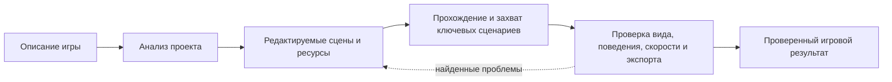

<p align="center">
  
</p>

<p align="center">
  <strong>Production-навык для Codex, который помогает разрабатывать и полировать игры на Godot 4.</strong><br>
  <a href="./README.md">English</a> · <a href="https://learn.chatgpt.com/docs/build-skills">Как устроены навыки Codex</a>
</p>

`skill-godot` задаёт Codex воспроизводимый процесс разработки настоящего проекта Godot: редактируемые сцены и ресурсы, цельные ассеты, удобное управление, детерминированные проверки, визуальная проверка, замеры производительности и готовый к публикации экспорт. Поддерживаются 2D, 3D, 2.5D, изометрические и ортографические игры, интерфейсы, звук, мобильное и веб-управление, а также релизы в Яндекс Играх.

## Быстрый старт

Попросите Codex установить репозиторий:

```text
Используй $skill-installer, чтобы установить https://github.com/Seno47/skill-godot
```

После установки явно подключите навык к задаче:

```text
Используй $skill-godot и сделай красивую изометрическую игру про кафе на Godot 4.
Мир должен оставаться редактируемым через сцены и ресурсы. Добавь мышь и тач,
запусти игру и проверь основной цикл на десктопном и мобильном размерах.
```

Codex также может выбрать навык автоматически, если запрос явно соответствует его описанию.

## Что входит в репозиторий

| Состав | Практическая польза |
| --- | --- |
| 20 профильных руководств | Архитектура сцен, 2D/3D/2.5D, UI, графика, звук, производительность, загрузка, экспорт и публикация |
| 12 детерминированных Python-утилит | Снимок структуры проекта, аудит сцен и ассетов, захват кадров, бюджеты производительности, оценка доказательств и размера сборки |
| 4 переиспользуемые Godot-пробы | Тач-прокрутка, компоновка кнопок, изометрическая проекция и навигация |
| Правила scene-first | Постоянная композиция хранится в `.tscn` и ресурсах Godot, а не скрывается в больших runtime-скриптах |
| Завершение по доказательствам | Навык запускает проект, проверяет типичные размеры экрана и не заявляет о полировке или оптимизации без проверки |

## Производственный цикл



Главный [`SKILL.md`](./SKILL.md) остаётся компактным маршрутизатором: Codex читает только те руководства, шаблоны, компоненты и тесты, которые нужны текущей задаче.

## Покрытие

- **Разработка игры:** механики, уровни, камера, свет, коллизии, навигация, UI, обучение, звук, VFX и интеграция ассетов.
- **2D и 3D:** нативные паттерны сцен Godot и отдельные рекомендации для каждого измерения.
- **2.5D и изометрия:** явный пространственный контракт для проекции, выбора клетки, сортировки, высоты, перекрытий, поиска пути и гибридного 2D/3D.
- **Управление:** клавиатура, мышь, контроллер, тач, drag-жесты и проверка мобильных размеров.
- **Оптимизация:** измерение FPS, CPU/GPU/physics, анализ памяти, загрузки и размера экспорта.
- **Веб и Яндекс Игры:** жизненный цикл SDK, реклама, rewarded-сценарии, сохранения, лидерборды, локализация, модерация и проверка архива.
- **Проверка:** headless-запуски, детерминированные пробы, автоматический захват, проверка обучения и независимый UX-разбор.

## Изометрия и 2.5D

Навык не считает «изометрию» только визуальным стилем. До того как пространственная логика разойдётся по всему проекту, он закрепляет один проверяемый контракт:

1. Выбирается основная архитектура: `Node2D`, `Node3D` или осознанный гибрид.
2. Фиксируются оси сетки, пропорции тайла, начало координат, шаг высоты, ключ сортировки, правило выбора и модель навигации.
3. Контракт записывается через [`isometric-spatial-contract.template.md`](./assets/isometric-spatial-contract.template.md).
4. При подходящем контракте используется [`isometric_projection.gd`](./assets/godot-components/isometric_projection.gd).
5. Пробы проекции и навигации адаптируются для проверки round-trip, смены высоты и маршрутов.

Полное руководство находится в [`references/isometric-and-2-5d.md`](./references/isometric-and-2-5d.md).

## Варианты установки

Самый простой вариант — запрос с `$skill-installer` из раздела выше. Для ручной пользовательской установки клонируйте репозиторий в актуальную папку пользовательских навыков Codex.

Windows PowerShell:

```powershell
git clone https://github.com/Seno47/skill-godot "$env:USERPROFILE\.agents\skills\skill-godot"
```

macOS или Linux:

```bash
git clone https://github.com/Seno47/skill-godot "$HOME/.agents/skills/skill-godot"
```

Если навык нужен только одному проекту, поместите его в `.agents/skills/skill-godot` внутри этого репозитория. Codex автоматически замечает изменения навыков; если новый навык не появился, перезапустите Codex. Области обнаружения и способы вызова описаны в [официальной документации OpenAI](https://learn.chatgpt.com/docs/build-skills).

## Примеры запросов

```text
Используй $skill-godot и преврати этот прототип в поддерживаемый вертикальный срез.
Сохрани художественный стиль, добавь тач-управление и проверь первое обучение.
```

```text
Используй $skill-godot и найди причину скачков времени кадра в проекте Godot 4.
Сначала измерь, затем найди узкое место, внеси точечное исправление и сравни результат.
```

```text
Используй $skill-godot и подготовь HTML5-игру к Яндекс Играм.
Добавь жизненный цикл SDK, сохранения, rewarded-рекламу, лидерборды,
русскую локализацию и проверку релизного архива, не меняя основной игровой цикл.
```

## Структура репозитория

```text
skill-godot/
├── SKILL.md                 # Область срабатывания и основной процесс
├── agents/openai.yaml       # Метаданные интерфейса Codex и стартовый запрос
├── references/              # Руководства по разработке и релизу
├── scripts/                 # Детерминированные аудиторы и сбор доказательств
├── assets/
│   ├── godot-components/    # Переиспользуемые компоненты Godot
│   ├── godot-tests/         # Адаптируемые детерминированные пробы
│   └── *.template.*         # Шаблоны пространства, UX, захвата и релиза
├── evals/                   # Схема доказательств и оценочная рубрика
└── tests/                   # Лёгкие и engine-backed тесты
```

## Проверка локальной копии

Для большинства тестов нужен только Python 3:

```bash
python -m unittest discover -s tests -p "test_*.py"
```

Изометрические smoke-тесты используют Godot 4, если `godot4`/`godot` доступен в `PATH` или переменная `GODOT_BIN` указывает на исполняемый файл редактора.

Пример для PowerShell:

```powershell
$env:GODOT_BIN = "C:\Tools\Godot\Godot.exe"
python -m unittest discover -s tests -p "test_*.py"
```

## Участие в разработке

Можно создавать issues и отправлять небольшие сфокусированные pull request. Сохраняйте навык scene-first, доказательным, ориентированным на Godot 4 и с прогрессивной загрузкой контекста: подробности лучше добавлять в отдельное руководство или переиспользуемый скрипт, а не раздувать `SKILL.md`. Перед pull request запустите тесты.

## Лицензия и статус

Лицензия пока не выбрана. Публичная доступность сама по себе не даёт общего разрешения на повторное использование и распространение. Это независимый проект сообщества, не официальный проект Godot Engine или OpenAI.

