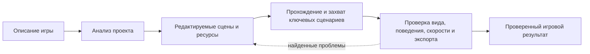

<p align="center">
  
</p>

<p align="center">
  <strong>Production-навык для Codex, который помогает разрабатывать и полировать игры на Godot 4.</strong><br>
  <a href="./README.md">English</a> · <a href="https://learn.chatgpt.com/docs/build-skills">Как устроены навыки Codex</a>
</p>

`skill-godot` задаёт Codex воспроизводимый процесс разработки настоящего проекта Godot: редактируемые сцены и ресурсы, цельные ассеты, удобное управление, детерминированные проверки, визуальная проверка, замеры производительности и готовый к публикации экспорт. Поддерживаются 2D, 3D, 2.5D, изометрические и ортографические игры; procedural, strategy, racing, action и narrative; одиночный, local/online multiplayer, extraction и честные MMO production slices; accessibility, localization, saves, replay, большие миры, LiveOps, native mobile/XR, runtime authoring, reproducible releases, crash recovery, commerce/cloud/safety, desktop hardware, modding/UGC, stores и Яндекс Игры.

## Быстрый старт

Попросите Codex установить репозиторий:

```text
Используй $skill-installer, чтобы установить https://github.com/Seno47/skill-godot
```

После установки явно подключите навык к задаче:

```text
Используй $skill-godot и сделай красивую изометрическую игру про кафе на Godot 4.
Мир должен оставаться редактируемым через сцены и ресурсы. Добавь мышь и тач,
запусти игру и проверь основной цикл на десктопном и мобильном размерах.
```

Codex также может выбрать навык автоматически, если запрос явно соответствует его описанию.

## Что входит в репозиторий

| Состав | Практическая польза |
| --- | --- |
| 63 профильных руководства | Архитектура сцен, выбор визуального стиля, 2D/3D/2.5D, high-angle районы, UI, saves, accessibility, AI, жанры/network, difficulty/pacing, commerce/cloud/safety, resilience/upgrades, hardware, ассеты, performance и release |
| 41 детерминированная Python-утилита | Аудиты проекта/ассетов, visual checks, genre-aware difficulty и system contracts, crash/commerce/cloud/safety/upgrade/fault/hardware/assistive-пробы, композиция rubric, capture, бюджеты, scorecard и build size |
| 7 переиспользуемых Godot-проб | Тач-прокрутка, компоновка кнопок, third-person управление/HUD mouse routing/видимость, изометрическая проекция и навигация |
| Правила scene-first | Постоянная композиция хранится в `.tscn` и ресурсах Godot, а не скрывается в больших runtime-скриптах |
| Завершение по доказательствам | Scorecard сверяет владельца приёмки и реальные пути к скриншотам, видео и review, отклоняя PASS только на словах |

## Производственный цикл



Главный [`SKILL.md`](./SKILL.md) остаётся компактным маршрутизатором: Codex читает только те руководства, шаблоны, компоненты и тесты, которые нужны текущей задаче.

## Покрытие

- **Разработка игры:** механики, уровни, камера, свет, коллизии, навигация, UI, обучение, звук, VFX и интеграция ассетов.
- **Визуальное направление:** требования пользователя остаются главнее скилла; для открытого брифа жизнеспособные 2D/3D/hybrid-направления сравниваются по gameplay-читаемости, идентичности, доступности цельных ассетов, устойчивости на всём объёме контента, нагрузке анимации/VFX, target-бюджетам, UI/localization/accessibility, правам, стоимости и сопровождению до массового производства.
- **2D и 3D:** нативные паттерны сцен Godot и отдельные рекомендации для каждого измерения.
- **2.5D и изометрия:** явный пространственный контракт для проекции, выбора клетки, сортировки, высоты, перекрытий, поиска пути и гибридного 2D/3D.
- **Fixed/high-angle 3D-районы:** видимые городские/ландшафтные границы, massing кварталов, landmarks/view corridors, функциональные story-зоны, бюджеты модульной вариативности/повторов и измеримая камера follow/look-ahead/pressure zoom/volumes.
- **Управление:** клавиатура, мышь, контроллер, camera-relative движение, orbit/capture recovery, тач, drag-жесты и проверка мобильных размеров.
- **Долговечные системы:** versioned save envelope, атомарная запись, восстановление после прерывания/повреждения, миграции, idempotence и правила cloud/device conflict.
- **AI и генерация:** честное восприятие, навигация/replan/crowd recovery, capacity evidence, именованные random streams, разрешимые seed cohorts, распределения, fallback и save/resume parity.
- **Специализированные жанры:** production-контракты для strategy/simulation, vehicle/racing, shooter/action, narrative/cinematics и одновременного local multiplayer с разделением builder correctness и человеческой оценки feel/comprehension.
- **Доступность:** remapping, hot-plug/focus recovery, правдивые modality/glyphs, смысл не только цветом, читаемые subtitles/captions, motion/flash/timing alternatives и независимая проверка эффекта настроек.
- **Оптимизация:** измерение FPS, CPU/GPU/physics, анализ памяти, загрузки и размера экспорта.
- **Веб и Яндекс Игры:** жизненный цикл SDK, реклама, rewarded-сценарии, сохранения, лидерборды, локализация, модерация и проверка архива.
- **Multiplayer и persistent online:** server authority, репликация, лаги/потери/reconnect, dedicated server, extraction settlement, честный MMO-scope, нагрузка сервисов, восстановление после сбоев, restore и rollback.
- **Платформы и расширяемость:** точные store candidates, clean install/update/signing/SDK lifecycle, а также явные trust tiers для mods/UGC, hostile-content validation, восстановление после удаления мода, safe mode и честные границы изоляции.
- **Глобальный и advanced production:** localization/plurals/pseudolocalization, replay/ghost/spectator, streamed-world traversal, реальные mobile devices, LiveOps/privacy, OpenXR/authorized console boundaries, runtime creator tools и воспроизводимые clean builds.
- **Production resilience и сервисы:** crash/hang recovery и diagnostics, exactly-once commerce entitlements, guest/cloud conflicts, proportional online safety, upgrade fixtures/rollback, deterministic fault injection, реальные desktop hardware/display matrices и проверка настоящими assistive technologies.
- **Проверка:** headless-запуски, детерминированные пробы, автоматический захват, проверка обучения и независимый UX-разбор.

Гибридные задачи используют канонический rubric selector `base+modifier+...`. `rubric_case_plan.py`, `evidence_helper.py` и `eval_scorecard.py` разделяют одну fail-closed композицию: применимые gates объединяются, а для каждой score dimension берётся самый строгий floor. Поэтому удобный жанровый label не может незаметно отбросить localization, replay, mobile, LiveOps или release-обязательства, при этом нерелевантные руководства не загружаются в контекст.

Для законченных 2.5D-игр теперь есть отдельный rubric case `new-2-5d-complete`. Он требует явную пространственную модель, raw-состояния quiet/normal/dense/VFX/result, видео production-анимации персонажа, проверку меню и semantic identity, читаемые глубину и контакты, независимую приёмку target build по UX/визуалу и человеческое прослушивание аудио. Наличие box/sphere/cylinder, shader quad или particles внутри `.tscn` доказывает редактируемую архитектуру, но не production-art.

Для fixed/high-angle 3D-районов добавлен компонуемый modifier `high-angle-3d-district-complete` и руководство [`high-angle-3d-districts.md`](./references/high-angle-3d-districts.md). Шаблон [`high-angle-3d-district-review.template.md`](./assets/high-angle-3d-district-review.template.md) отклоняет забор по периметру, filler из контейнеров/клонов зданий, бессмысленный scatter и коридоры взгляда в пустоту; вместо этого он требует совпадение видимой границы с collision, иерархию района, многослойную вариативность и raw-видео полного восстановления камеры в normal speed.

Жанровый слой теперь содержит условные production-контракты для файтингов, метроидваний, idle/clicker-экономик и квестовых систем, но не превращает чужие демо в универсальную архитектуру. Отдельный проверенный каталог экосистемы объясняет, когда шаблоны меню/настроек, UI-темы, portal bridge, combat-addon, шейдер или библиотека компонентов действительно полезны, экспериментальны, устарели, ограничены лицензией либо конфликтуют с владельцами систем текущего проекта.

Для поиска ассетов есть отдельный маршрутизатор источников: 2D, 3D, UI, записанный звук, музыка, шрифты, шейдеры и анимация. Он отличает CC0-библиотеки от смешанных пользовательских каталогов и marketplace EULA, а затем требует проверить происхождение конкретного файла, ограничить shortlist, оценить соответствие стилю и проверить интеграцию в Godot.

Новые законченные игры и production slices теперь используют [`visual-style-selection.md`](./references/visual-style-selection.md) и [`art-direction-selection.template.md`](./assets/art-direction-selection.template.md) до массового создания визуала. Зафиксированное пользователем направление переводится в production-контракт без искусственных альтернатив; открытый бриф сравнивает серьёзные варианты на одинаковом игровом содержании и фиксирует пространственную архитектуру, способ изготовления, формы, палитру/материалы, свет, motion/VFX, типографику/UI, источники ассетов, производительность, размер, права, стоимость и сопровождение. Для pixel, vector, illustrated, cutout, pre-rendered, stylized/toon/voxel/retro/PBR 3D, minimalist/procedural, isometric и hybrid-направлений добавлены профильные причины отказа. Rubric закрывается с FAIL/BLOCKED без decision record и raw gameplay-size anchor/composition из Godot.

Долгая автономная работа может создать [`project-run-state.template.md`](./assets/project-run-state.template.md), чтобы подтверждённое состояние игры, build ID, команды, evidence, стоимость/job ассетов и следующие ограниченные действия переживали смену контекста без бесконечного дневника. Платная генерация хранит фактическую стоимость и возобновляемый provider job/sidecar до polling, а визуальный ассет — свой финальный gameplay-size контракт. Инструментальная сборка сцен обязана доказать совпадение дерева в памяти, packed instance и после загрузки с диска; [`godot_capture.py`](./scripts/godot_capture.py) умеет рассчитывать детерминированную 15–20-секундную proof-запись, которую builder полностью просматривает перед handoff.

Для утверждённых UI-референсов добавлен нативный parity-workflow: формальные экраны остаются видимыми в редакторе сценами, а [`image_compare.py`](./scripts/image_compare.py) создаёт side-by-side, overlay и diff в одинаковом разрешении. Для графов прогрессии и idle-кривых есть JSON-модели и детерминированные пробы; их числовой PASS всё равно не заменяет прохождение целевой сборки и человеческий UX-review.

Для игр, где прогрессия является основой, добавлен межжанровый контракт [`progression-and-balance.md`](./references/progression-and-balance.md). Переиспользуемые [`progression-balance.template.json`](./assets/progression-balance.template.json) и [`progression_balance_probe.py`](./scripts/progression_balance_probe.py) проверяют заявленные архетипы игроков, ранние/средние/поздние точки, соотношение силы и сложности, засухи наград и решений, восстановление, доминирование вариантов, границы ресурсов и концентрацию источников/стоков. Отдельный [`progression-balance-review.template.md`](./assets/progression-balance-review.template.md) оставляет корректность модели и сборки обязанностью builder-а, но не позволяет объявить темп, grind или качество наград проверенными без реальных uncoached human traces.

Сложность получила отдельный genre-aware envelope в [`difficulty-and-pacing.md`](./references/difficulty-and-pacing.md). [`difficulty-pacing-contract.template.json`](./assets/difficulty-pacing-contract.template.json) и [`difficulty_pacing_probe.py`](./scripts/difficulty_pacing_probe.py) раздельно отслеживают execution, cognition, time, resources, punishment, uncertainty, coordination и navigation/information load; комбинации изученных навыков; novelty; пики/передышки либо добровольно выбранный риск; retry-бюджеты и честные границы адаптации. Puzzle mastery, action waves, horror tension, roguelite runs, progression scaling, strategy concurrency, racing catch-up, extraction routes, co-op director, competitive matchmaking, narrative load и sandbox choice не сводятся к одной кривой. Детерминированный PASS доказывает согласованность заявленного envelope и его прохождение в target build; [`difficulty-pacing-review.template.md`](./assets/difficulty-pacing-review.template.md) по-прежнему требует clean-profile uncoached human traces для оценки справедливости, усталости и темпа.

Четыре новых детерминированных контракта делают сохранения, input/accessibility, AI/navigation и процедурную генерацию проверяемыми до субъективного review: [`save_data_probe.py`](./scripts/save_data_probe.py), [`input_accessibility_probe.py`](./scripts/input_accessibility_probe.py), [`ai_navigation_probe.py`](./scripts/ai_navigation_probe.py) и [`procedural_generation_probe.py`](./scripts/procedural_generation_probe.py). Соответствующие rubric cases для strategy, racing, shooter, narrative, local multiplayer, multi-platform release и modding/UGC закрываются с FAIL/BLOCKED, если нет обязательных target-build либо human/independent evidence.

Для сетевых игр теперь используются [`multiplayer-networking.md`](./references/multiplayer-networking.md), [`network-contract.template.json`](./assets/network-contract.template.json) и [`network_contract_probe.py`](./scripts/network_contract_probe.py): они блокируют localhost-only успех, client authority, небезопасные RPC, отсутствие lag/loss/reconnect-проверок, несовместимый с платформой transport и неподтверждённые заявления о масштабе. Extraction получает отдельный raid/stash-ledger через [`genre-extraction.md`](./references/genre-extraction.md) и [`extraction_loop_probe.py`](./scripts/extraction_loop_probe.py). MMO намеренно оценивается как production slice по [`mmo-and-online-services.md`](./references/mmo-and-online-services.md): до production-ready заявления нужны реальные client/server артефакты, identity/persistence, interest/zone ownership, load/soak, observability, failure injection, restore и rollback.

Восемь release-modifiers теперь закрывают crash resilience, commerce/entitlements, accounts/cloud, online safety, upgrade compatibility, fault injection, desktop hardware/display и assistive accessibility. У каждого есть отдельное руководство, проходящий JSON-scaffold, fail-closed probe, review template, rubric case и score cap. Они подключаются только когда действительно нужны: routine correctness остаётся обязанностью builder-а, а реальное железо, assistive technology и независимые security/operations-решения честно остаются отдельными gates.

## Изометрия и 2.5D

Навык не считает «изометрию» только визуальным стилем. До того как пространственная логика разойдётся по всему проекту, он закрепляет один проверяемый контракт:

1. Выбирается основная архитектура: `Node2D`, `Node3D` или осознанный гибрид.
2. Фиксируются оси сетки, пропорции тайла, начало координат, шаг высоты, ключ сортировки, правило выбора и модель навигации.
3. Контракт записывается через [`isometric-spatial-contract.template.md`](./assets/isometric-spatial-contract.template.md).
4. При подходящем контракте используется [`isometric_projection.gd`](./assets/godot-components/isometric_projection.gd).
5. Пробы проекции и навигации адаптируются для проверки round-trip, смены высоты и маршрутов.
6. До массовой сборки уровней герой, механизм, цель, декор, свет и UI проходят gameplay-size gate по [`isometric-complete-review.template.md`](./assets/isometric-complete-review.template.md).
7. Отделение героя от фона измеряется по маске того же кадра через [`isometric_readability_audit.py`](./scripts/isometric_readability_audit.py), композиция маршрута проверяется независимо, а заявленная длительность подтверждается через [`content-duration-contract.template.md`](./assets/content-duration-contract.template.md).

Полное руководство находится в [`references/isometric-and-2-5d.md`](./references/isometric-and-2-5d.md).

## Проверка 3D от третьего лица

Для свободно вращаемой камеры скилл проверяет движение относительно камеры после yaw, реальный mouse motion через видимый production HUD, обе оси правого стика, zoom/recenter, восстановление камеры после препятствия, видимость персонажа за несколькими occluder-объектами и через реальные отверстия, контраст маршрута в точном high-structure ракурсе, восстановление cutaway, mouse capture после паузы/фокуса, видимость мира за HUD, безопасное обучение и человеческое прослушивание звука. Адаптируйте [`third_person_controller_probe.gd`](./assets/godot-tests/third_person_controller_probe.gd), [`third_person_hud_mouse_probe.gd`](./assets/godot-tests/third_person_hud_mouse_probe.gd) и [`third_person_visibility_probe.gd`](./assets/godot-tests/third_person_visibility_probe.gd), затем заполните [`third-person-3d-review.template.md`](./assets/third-person-3d-review.template.md); одной проверки кода, прямого вызова look-метода или SpringArm для PASS недостаточно.

Для анимированных production-персонажей действует отдельный builder-owned gate [`production-character-motion.template.md`](./assets/production-character-motion.template.md). Он требует реального idle/locomotion/context dispatch, отклонения bind/rest/T-pose, следования вложений за анимированным сокетом и raw target-build motion до необязательной пользовательской оценки вкуса. Пользователь не должен становиться тем, кто выполняет рутинный поиск замёрзшего персонажа.

Для законченной игры также используется [`semantic-identity-review.template.md`](./assets/semantic-identity-review.template.md): app icon и знак главного меню должны без подсказки передавать связанную с игрой идею в реальном размере. Единая палитра или аккуратный набор примитивов сами по себе не считаются идентичностью.

Само меню проходит отдельный gate [`menu-identity-craft-review.template.md`](./assets/menu-identity-craft-review.template.md): wordmark/типографика, необходимость каждого текста, фон, иерархия, контролы и отсутствие шаблонной композиции. [`production-art-state-review.template.md`](./assets/production-art-state-review.template.md) требует raw target-build кадры quiet, normal, dense interaction, VFX peak и result, чтобы красивое пустое начало не скрывало пересечения, сломанную глубину/контакты, debug-подобные эффекты, редкие примитивные модули или несовместимые семейства ассетов.

Для игрового HUD теперь есть собственный блокирующий gate [`gameplay-hud-glanceability-review.template.md`](./assets/gameplay-hud-glanceability-review.template.md). Builder составляет инвентарь всех постоянных и контекстных текстовых зон, решает для каждой `оставить / сократить / заменить иконкой / перенести в мир / удалить`, а затем получает независимый raw-review состояний quiet, normal, dense и VFX peak из target build. Частая телеметрия должна мгновенно считываться через цельное авторское семейство иконок, форм и значений, но не превращаться в непонятный icon-only UI, передачу смысла только цветом или локализуемый абзац.

First-use и interface acceptance теперь fail-closed проверяют perceptual discoverability и качество поверхности: чистый кадр обязан помочь заметить обучение и связать input с target/feedback/consequence; settings-capture должен показывать авторскую семью slider/switch/check/focus, а не native-looking scaffolding; complete-game surfaces не могут строиться из повторяющихся подписанных прямоугольников; aim/trajectory/route telegraphs обязаны передавать origin, direction, contacts, endpoint и validity в выбранном художественном языке. Для progression-heavy cases добавлен независимый пятисоставный visual-comprehension gate — current, first reward, first choice, purchased/unlocked, locked/late — поэтому корректные арифметика, saves, solver и localization больше не заменяют понимание того, что изменилось, что доступно дальше, сколько это стоит и какое новое решение создаёт unlock.

В passing evidence теперь фиксируются `reviewer.role`, конкретный контекст проверяющего и структурированные пути к артефактам. `eval_scorecard.py` понижает заявленный PASS до FAIL, если builder сам выдал себе independent/human verdict, обязательное состояние не приложено либо скриншот/видео/review отсутствует, пуст или имеет неверный тип. `evidence_helper.py` создаёт и мигрирует evidence; старые статусы сохраняются, но неуказанное происхождение проверки больше не проходит незаметно.

Отдельные автономные workflow-идеи были независимо адаптированы из [Godogen](https://github.com/htdt/godogen), без переноса его стека целиком. Границы и обоснование зафиксированы в [`references/evaluated-ecosystem.md`](./references/evaluated-ecosystem.md).

## Варианты установки

Самый простой вариант — запрос с `$skill-installer` из раздела выше. Для ручной пользовательской установки клонируйте репозиторий в актуальную папку пользовательских навыков Codex.

Windows PowerShell:

```powershell
git clone https://github.com/Seno47/skill-godot "$env:USERPROFILE\.agents\skills\skill-godot"
```

macOS или Linux:

```bash
git clone https://github.com/Seno47/skill-godot "$HOME/.agents/skills/skill-godot"
```

Если навык нужен только одному проекту, поместите его в `.agents/skills/skill-godot` внутри этого репозитория. Codex автоматически замечает изменения навыков; если новый навык не появился, перезапустите Codex. Области обнаружения и способы вызова описаны в [официальной документации OpenAI](https://learn.chatgpt.com/docs/build-skills).

## Примеры запросов

```text
Используй $skill-godot и преврати этот прототип в поддерживаемый вертикальный срез.
Сохрани художественный стиль, добавь тач-управление и проверь первое обучение.
```

```text
Используй $skill-godot и найди причину скачков времени кадра в проекте Godot 4.
Сначала измерь, затем найди узкое место, внеси точечное исправление и сравни результат.
```

```text
Используй $skill-godot и подготовь HTML5-игру к Яндекс Играм.
Добавь жизненный цикл SDK, сохранения, rewarded-рекламу, лидерборды,
русскую локализацию и проверку релизного архива, не меняя основной игровой цикл.
```

## Структура репозитория

```text
skill-godot/
├── SKILL.md                 # Область срабатывания и основной процесс
├── agents/openai.yaml       # Метаданные интерфейса Codex и стартовый запрос
├── references/              # Руководства по разработке и релизу
├── scripts/                 # Детерминированные аудиторы и сбор доказательств
├── assets/
│   ├── godot-components/    # Переиспользуемые компоненты Godot
│   ├── godot-tests/         # Адаптируемые детерминированные пробы
│   └── *.template.*         # Шаблоны пространства, UX, захвата и релиза
├── evals/                   # Схема доказательств и оценочная рубрика
└── tests/                   # Лёгкие и engine-backed тесты
```

## Проверка локальной копии

Для большинства тестов нужен только Python 3:

```bash
python -m unittest discover -s tests -p "test_*.py"
```

Для `scripts/image_compare.py` дополнительно нужен Pillow. Если его нет, соответствующие тесты корректно пропускаются, а утилита явно сообщает о зависимости вместо ослабления parity-проверки.

Изометрические smoke-тесты используют Godot 4, если `godot4`/`godot` доступен в `PATH` или переменная `GODOT_BIN` указывает на исполняемый файл редактора.

Пример для PowerShell:

```powershell
$env:GODOT_BIN = "C:\Tools\Godot\Godot.exe"
python -m unittest discover -s tests -p "test_*.py"
```

## Участие в разработке

Можно создавать issues и отправлять небольшие сфокусированные pull request. Сохраняйте навык scene-first, доказательным, ориентированным на Godot 4 и с прогрессивной загрузкой контекста: подробности лучше добавлять в отдельное руководство или переиспользуемый скрипт, а не раздувать `SKILL.md`. Перед pull request запустите тесты.

## Лицензия и статус

Лицензия пока не выбрана. Публичная доступность сама по себе не даёт общего разрешения на повторное использование и распространение. Это независимый проект сообщества, не официальный проект Godot Engine или OpenAI.
